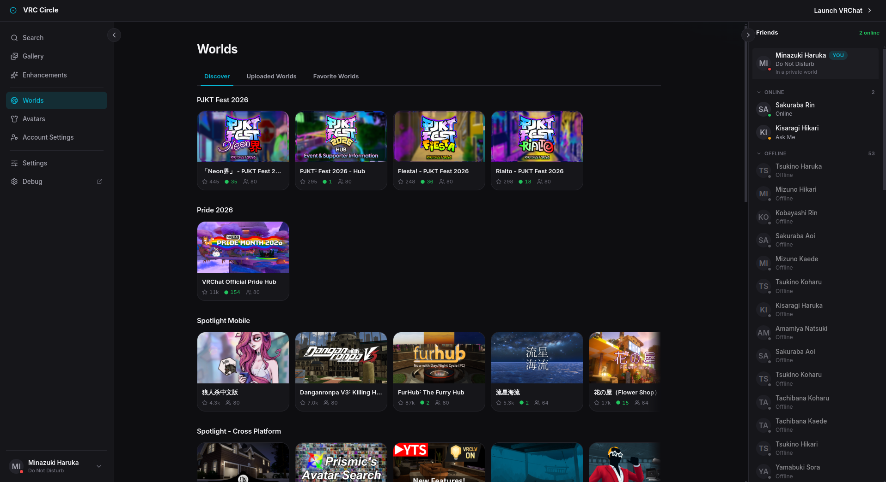

# 🔵 VRC Circle

An unofficial VRChat desktop hub and launcher built with Electron, React, and the community VRChat SDK.



> [!WARNING]
> VRC Circle is in heavy development. Expect bugs, incomplete features, breaking changes, and rough edges. Use it at your own risk.

## Features

- Accounts
- Friends and presence
- Worlds, avatars, groups, and profiles
- Favorites
- Gallery
- Launcher tools
- Enhancements
- Themes and localization
- Unity project tools (TODO)

## Development

```bash
pnpm install
pnpm dev
pnpm build
```

## VRChat Guidelines

Use VRC Circle responsibly and follow VRChat's [Creator Guidelines](https://hello.vrchat.com/creator-guidelines), Community Guidelines, and Terms of Use.

## Disclaimer

VRC Circle is not affiliated with, endorsed by, or sponsored by VRChat Inc.
